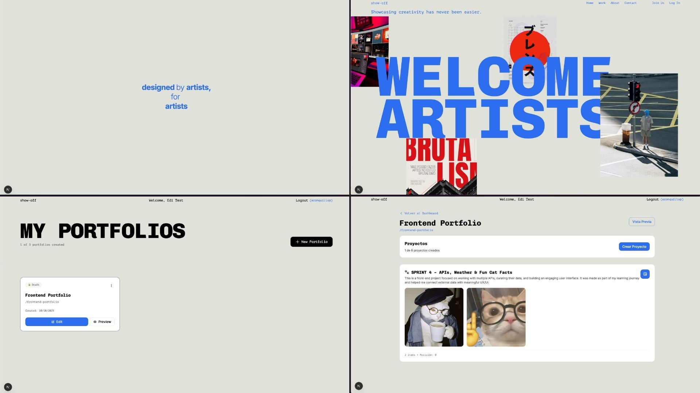

# 🎨 show-off.art – Creative Portfolio Platform

**show-off.art** is a platform designed for creative professionals — designers, filmmakers, photographers, and artists — to build visually striking online portfolios using modern, fast, and customizable templates.  

This is my final project, built to explore how design systems, authentication, and smooth UI transitions can coexist in a real product. I wanted to create a space where creativity meets functionality — a place to **show off your art**.

---

## 🖼️ Preview

[]()

---

## 🧠 Tech Stack

[](https://skillicons.dev)

- **Next.js (App Router)** — Modern full-stack framework for React  
- **React + TypeScript** — Component-driven architecture with type safety  
- **Tailwind CSS v4** — Utility-first CSS for fast, consistent styling  
- **Supabase** — Auth + Postgres + Storage (with RLS)  
- **Framer Motion** — Page transitions, parallax, and smooth visual effects  

---

## ✨ Features

### 🔐 Authentication
- Magic Link (Email) and Google OAuth via Supabase.
- Secure session handling with cookie refresh through middleware.
- Onboarding flow with username and profile setup.

### 🧩 Custom Hooks & Animations
- `usePageTransition` for cinematic page wipes between routes.  
- `useParallax` and scroll-based visual effects for portfolio previews.  
- `useLockBodyScroll` to manage modals and splash screens smoothly.  
- Motion-driven UI built around **Framer Motion** for subtle transitions.

### 🖥️ Dashboard
- Personalized dashboard where users can manage their portfolios.  
- Create, edit, or delete portfolios and projects.  
- Instant previews before publishing.

### 📤 Upload & Media Management
- Image and CV upload to Supabase Storage with RLS protection.  
- Signed URLs for secure asset access.  
- Optimized image rendering and preview feedback.

### 💅 UI / UX
- Minimal, modern design with variable fonts and adaptive themes.  
- Focus on creative readability and immersive navigation.  
- Consistent motion language across pages.

---

## 🧱 Project Architecture

```
src/
├─ app/
│  ├─ (public)/       ← about/, auth/, home/, terms/, contact/, cookies/
│  ├─ (app)/          ← dashboard/, onboarding/, preview/, u/
│  ├─ auth/           ← authentication routes
│  ├─ globals.css     ← Tailwind global styles
│  └─ layout.tsx
│
├─ features/
│  ├─ auth/           ← forms, validation schemas, onboarding logic
│  ├─ dashboard/      ← dashboard UI and actions
│  ├─ portfolio/      ← portfolio CRUD, preview & editor components
│  ├─ storage/        ← upload actions and helpers
│  └─ ...
│
├─ components/        ← shared UI elements and layout components
├─ hooks/             ← custom visual + UX hooks (transitions, parallax)
├─ lib/               ← supabase clients, helpers, and middleware
└─ types/             ← TypeScript interfaces and types
```

---

## ⚙️ Getting Started

**Clone the repository**

```bash
git clone git@github.com:your-username/show-off.art.git
```

**Install dependencies**

```bash
npm install
```

**Set environment variables**

Create a `.env` file in the project root:

```
NEXT_PUBLIC_SUPABASE_URL=your_supabase_url
NEXT_PUBLIC_SUPABASE_ANON_KEY=your_supabase_anon_key
SUPABASE_SERVICE_ROLE_KEY=your_service_role_key
NEXT_PUBLIC_SITE_URL=http://localhost:3000
```

**Run development server**

```bash
npm run dev
```

---

## 🧭 To-do / Next Steps

- [ ] Improve **portfolio template** ← CRITICAL! ⚠️
- [ ] Add **testing** ← CRITICAL x2! ⚠️
- [ ] Add drag-and-drop **Template Editor** with real-time preview  
- [ ] Add **custom domains** for user portfolios (`username.show-off.art`)  
- [ ] Implement **project categories / tags** for filtering  
- [ ] Create **dark/light theme switcher**  
- [ ] Enhance **image optimization and caching**  
- [ ] Create **mobile-first publishing flow**  
- [ ] Refactor dashboard layout for better scalability  

---

## 📓 Dev Journal

Building **show-off.art** has been one of the most creative and technically challenging projects I’ve done so far.  
My main goal was to blend **aesthetics and interaction** — where every animation, transition, and layout choice serves a purpose: guiding attention and enhancing storytelling.  

I spent time crafting reusable **hooks** for page transitions, parallax effects, and scroll-locked modals — all designed to make navigation feel alive. Authentication and route protection taught me how to structure a secure front-end experience, while maintaining simplicity for users.  

The project continues to evolve, but even now, it represents what I value most: **polish, clarity, and creative control**.

---

## 🚧 Project Status

